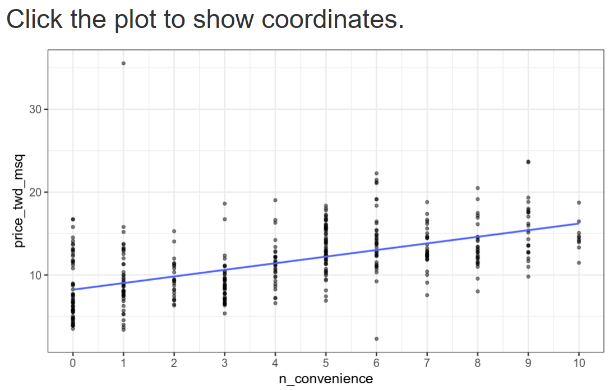
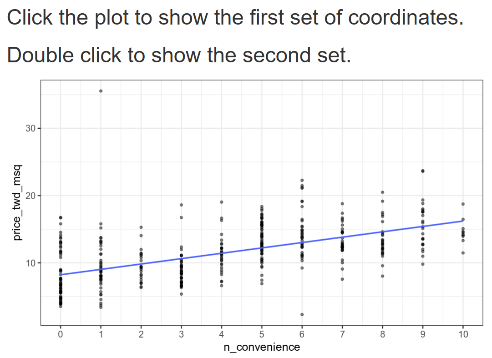

## Estimate the Intercept

Looking at the scatter plot, I can see the blue trend line and need to estimate where it intersects the y-axis (when x = 0).

Following the blue regression line back to where it crosses the y-axis (at x = 0), the intercept appears to be around 8-9 on the y-axis scale.
Given the multiple choice options:

0
8.22
16.21

The correct answer is 8.22, as this matches where the trend line intersects the y-axis when the number of convenience stores (x-axis) equals zero.
The intercept represents the predicted house price per area when there are no nearby convenience stores, which according to this linear regression model would be approximately 8.22 (in whatever units the price_twd_msq variable represents).

## Estimate the slope

Looking at the scatter plot with the blue trend line, I need to estimate the slope by observing how much the y-value (price_twd_msq) increases for each unit increase in x-value (n_convenience).

From the trend line, I can see that:

At x = 0, y ≈ 8.2 (the intercept we found earlier)
At x = 10, y ≈ 16.2

The slope can be calculated as:
Slope = (change in y) / (change in x) = (16.2 - 8.2) / (10 - 0) = 8.0 / 10 = 0.8
Looking at the multiple choice options:

0.8 ✅
1
8.22

The correct answer is 0.8. This means that for each additional convenience store nearby, the house price per area increases by approximately 0.8 units on average.
