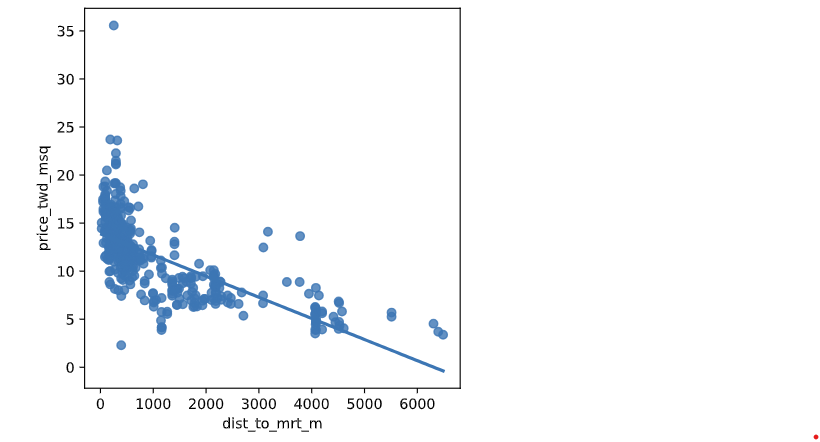
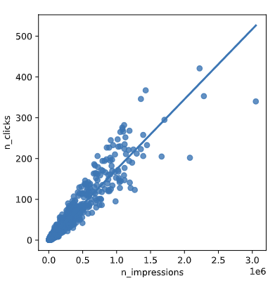

# Variable Transformations in Linear Regression

## Introduction

When there's no straight-line relationship between response and explanatory variables, transformations can often create linear relationships. This technique allows us to use linear regression on non-linear data patterns.

## Part 1: Transforming the Explanatory Variable

### Concept

Sometimes the relationship between variables follows a curve rather than a straight line. By transforming one variable (often taking square root, logarithm, or other functions), we can "straighten out" the relationship.

### Taiwan Real Estate Example

Using distance to the nearest MRT (metro) station as the explanatory variable for house prices.

### Task

Transform the distance variable using square root to improve the linear relationship.

### Solution

```python
# Create sqrt_dist_to_mrt_m
taiwan_real_estate["sqrt_dist_to_mrt_m"] = np.sqrt(taiwan_real_estate["dist_to_mrt_m"])

plt.figure()

# Plot using the transformed variable
sns.regplot(x="sqrt_dist_to_mrt_m", y="price_twd_msq", data=taiwan_real_estate)
plt.show()
```


**Code Explanation:**

- `np.sqrt()` - applies square root transformation to distance values
- Creates new column `sqrt_dist_to_mrt_m` with transformed values
- `sns.regplot()` - plots relationship using transformed x-variable
- The x-axis now shows square root of distance rather than raw distance

**Why Square Root?**

- Square root transformation compresses larger values more than smaller ones
- Often helps when the relationship curves downward (diminishing effects)
- Common for variables where effects decrease at higher values

## Part 2: Transforming Both Variables

### Digital Advertising Example

Analyzing the relationship between ad impressions and clicks, where both variables may benefit from transformation.

### Task

Apply quarter-root transformation (power of 0.25) to both impressions and clicks.

### Solution

```python
# Create qdrt_n_impressions and qdrt_n_clicks
ad_conversion["qdrt_n_impressions"] = ad_conversion["n_impressions"]**0.25
ad_conversion["qdrt_n_clicks"] = ad_conversion["n_clicks"]**0.25

plt.figure()

# Plot using the transformed variables
sns.regplot(y="qdrt_n_clicks", x="qdrt_n_impressions", data=ad_conversion)
plt.show()
```


**Code Explanation:**

- `**0.25` - raises values to the power of 0.25 (quarter-root transformation)
- Creates transformed versions of both impression and click variables
- Both x and y axes now show transformed scales
- Points should track the regression line more closely than with raw data

**Why Quarter-Root (0.25 power)?**

- More aggressive transformation than square root (0.5 power)
- Useful for highly skewed data with extreme values
- Compresses the scale significantly, reducing influence of outliers

## Part 3: Back Transformation

### The Challenge

When you transform the response variable, predictions are also on the transformed scale. To interpret results meaningfully, you must "back-transform" predictions to the original scale.

### Task

Convert quarter-root predictions back to the original clicks scale.

### Solution

```python
# Back transform qdrt_n_clicks
prediction_data["n_clicks"] = prediction_data["qdrt_n_clicks"]**4
print(prediction_data)
```

**Code Explanation:**

- `**4` - reverses the quarter-root transformation (since 0.25 × 4 = 1)
- Creates `n_clicks` column with values on original scale
- Now predictions can be interpreted as actual click counts

## Key Transformation Concepts

### Common Transformations

- **Square root** (`**0.5`) - Moderate compression of large values
- **Logarithm** (`np.log()`) - Strong compression, handles exponential relationships
- **Reciprocal** (`1/x`) - For inverse relationships
- **Power transformations** (`**p`) - Flexible family of transformations

### When to Transform

- **Curved relationships** - Data points form clear curve rather than straight line
- **Heteroscedasticity** - Variance changes across the range of data
- **Skewed distributions** - Extreme values dominate the relationship
- **Domain knowledge** - Theory suggests non-linear relationship

### Back Transformation Rules

- **Square root** → Square the predictions (`**2`)
- **Logarithm** → Exponentiate the predictions (`np.exp()`)
- **Power p** → Raise to power 1/p (`**(1/p)`)
- **Reciprocal** → Take reciprocal again (`1/prediction`)

### Benefits of Transformation

- **Linearizes relationships** - Enables use of linear regression
- **Improves model fit** - Points track the line more closely
- **Meets assumptions** - Helps satisfy linear regression assumptions
- **Better predictions** - More accurate forecasts when relationships are truly non-linear

### Important Considerations

- **Interpretation changes** - Coefficients represent effects on transformed scale
- **Always back-transform** - For meaningful interpretation of predictions
- **Verify improvement** - Check that transformation actually improves fit
- **Consider alternatives** - Sometimes non-linear models are more appropriate

# Model Evaluation Metrics - Coefficient of Determination and RSE

## Introduction

When comparing linear regression models, we need quantitative measures to determine which model fits the data better. Two key metrics are the coefficient of determination (R-squared) and the residual standard error (RSE).

## Part 1: Coefficient of Determination

### What is R-squared?

The coefficient of determination measures how well the linear regression line fits the observed values. It represents the proportion of variance in the response variable explained by the model.

- **Range**: 0 to 1 (or 0% to 100%)
- **Interpretation**: Higher values indicate better fit
- **For simple linear regression**: R² = (correlation coefficient)²

### Comparing Models

We have two advertising models to compare:

- `mdl_click_vs_impression_orig` - Original model: n_clicks vs n_impressions
- `mdl_click_vs_impression_trans` - Transformed model: quarter-root of both variables

### Task

Compare the R-squared values by examining model summaries.

### Solution

```python
# Print a summary of mdl_click_vs_impression_orig
print(mdl_click_vs_impression_orig.summary())

# Print a summary of mdl_click_vs_impression_trans
print(mdl_click_vs_impression_trans.summary())
```

**What to Look For:**

- Find the R-squared value in each summary
- Compare which model explains more variance
- Higher R-squared indicates better explanatory power

## Part 2: Residual Standard Error (RSE)

### What is RSE?

Residual Standard Error measures the typical size of prediction errors. It tells you how wrong you can expect predictions to be, on average.

**Formula**: RSE = √(MSE) = √(Mean Squared Error)

### Interpretation

- **Units**: Same units as the response variable
- **Range**: 0 to infinity
- **Better models**: Have smaller RSE values
- **Perfect fit**: RSE = 0 (no prediction errors)

### Task

Calculate and compare RSE for both models.

### Solution

```python
# Calculate mse_orig for mdl_click_vs_impression_orig
mse_orig = mdl_click_vs_impression_orig.mse_resid

# Calculate rse_orig for mdl_click_vs_impression_orig and print it
rse_orig = np.sqrt(mse_orig)
print("RSE of original model: ", rse_orig)

# Calculate mse_trans for mdl_click_vs_impression_trans
mse_trans = mdl_click_vs_impression_trans.mse_resid

# Calculate rse_trans for mdl_click_vs_impression_trans and print it
rse_trans = np.sqrt(mse_trans)
print("RSE of transformed model: ", rse_trans)
```

**Code Explanation:**

- `mdl.mse_resid` - extracts Mean Squared Error from model
- `np.sqrt(mse)` - calculates RSE as square root of MSE
- Compare RSE values to determine which model has smaller prediction errors

## Understanding the Metrics

### R-squared (Coefficient of Determination)

**Advantages:**

- Scale-independent (always between 0 and 1)
- Easy to interpret as percentage of variance explained
- Allows comparison across different datasets

**Interpretation Guide:**

- **R² = 0.0**: Model explains no variance (no better than predicting the mean)
- **R² = 0.5**: Model explains 50% of the variance
- **R² = 1.0**: Perfect fit (explains all variance)

### Residual Standard Error (RSE)

**Advantages:**

- In same units as response variable
- Directly interpretable as typical prediction error
- Gives concrete sense of model accuracy

**Interpretation Guide:**

- **Lower RSE**: More accurate predictions
- **RSE in context**: Compare to typical values of response variable
- **RSE = 0**: Perfect predictions (rarely achieved in practice)

## Comparing Original vs Transformed Models

### Expected Results

The transformed model should generally perform better because:

- **Linearized relationship**: Quarter-root transformation straightens curved relationships
- **Reduced influence of outliers**: Transformation compresses extreme values
- **Better assumption compliance**: Transformed data often meets linear regression assumptions better

### Key Considerations for Transformed Models

**Important caveat**: When comparing RSE values between original and transformed models:

- Transformed model RSE is on the transformed scale
- Direct comparison isn't always meaningful
- Need to consider back-transformation effects
- R-squared comparison is more reliable for transformed models

### Decision Framework

**Choose the model with:**

- **Higher R-squared** (explains more variance)
- **Lower RSE** (smaller prediction errors)
- **Better residual patterns** (more on this in diagnostic chapters)
- **More interpretable coefficients** (if interpretation is important)

## Practical Application

### Model Selection Process

1. **Fit multiple models** (original, transformed, different variables)
2. **Calculate evaluation metrics** (R², RSE, others)
3. **Compare performance** across metrics
4. **Consider interpretability** vs accuracy trade-offs
5. **Validate on new data** (when available)

### Beyond Single Metrics

While R² and RSE are important, also consider:

- **Residual plots** for assumption checking
- **Cross-validation** for generalization assessment
- **Domain knowledge** for practical applicability
- **Model complexity** vs performance trade-offs
