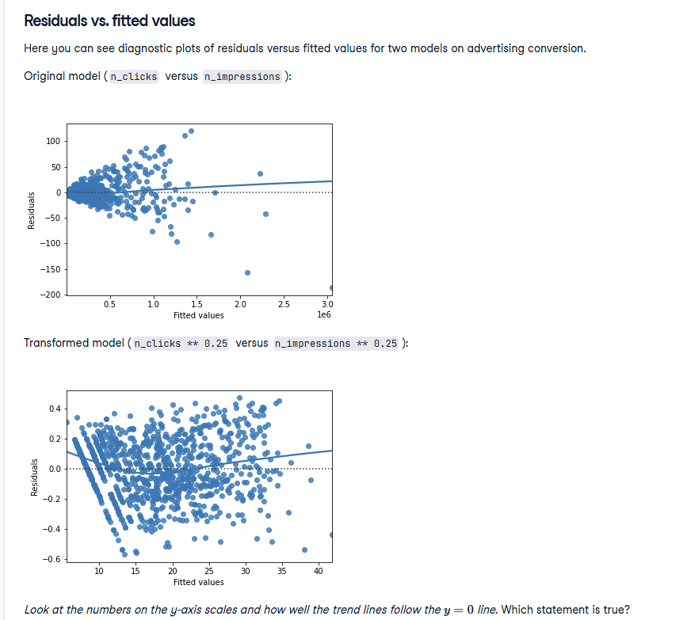
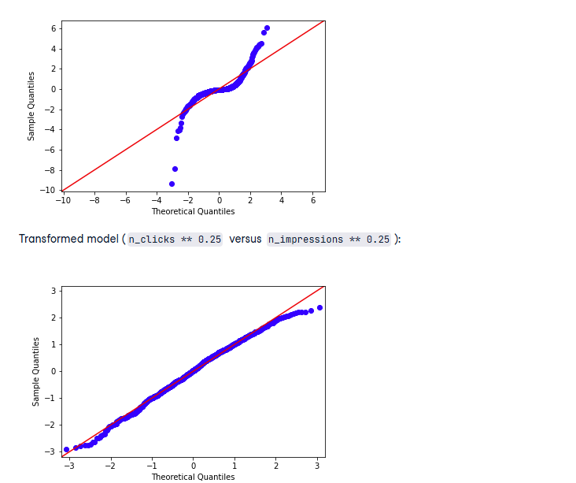
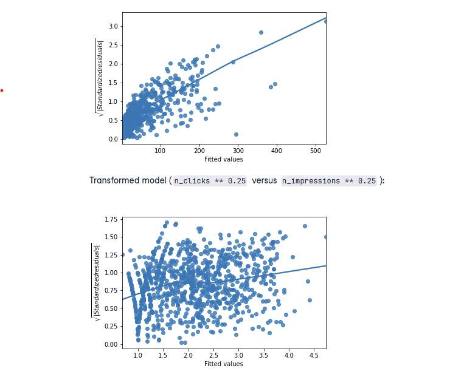

# Residuals vs. Fitted Values - Diagnostic Plot Analysis

## Introduction

Residuals vs. fitted values plots are crucial diagnostic tools for evaluating linear regression models. These plots help identify whether the linear model assumptions are met and which model provides a better fit to the data.

## Understanding the Plots



### What to Look For

The ideal residuals vs. fitted values plot should show:

- **Random scatter** around the horizontal line at y = 0
- **No clear patterns** or trends in the residuals
- **Constant variance** (homoscedasticity) across all fitted values
- **Trend line close to y = 0** throughout the range of fitted values

### Original Model Analysis

**Model**: `n_clicks` versus `n_impressions`

**Observations from the plot:**

- **Y-axis scale**: Residuals range from approximately -200 to +150
- **Pattern**: Clear curved pattern in the residuals
- **Trend line**: Deviates significantly from the y = 0 line
- **Variance**: Appears to increase with fitted values (heteroscedasticity)
- **Distribution**: Residuals show systematic departure from randomness

### Transformed Model Analysis

**Model**: `n_clicks ** 0.25` versus `n_impressions ** 0.25`

**Observations from the plot:**

- **Y-axis scale**: Residuals range from approximately -0.6 to +0.4 (much smaller scale)
- **Pattern**: Much more random scatter around zero
- **Trend line**: Follows the y = 0 line much more closely
- **Variance**: More consistent across fitted values
- **Distribution**: Residuals appear more randomly distributed

## Diagnostic Interpretation

### Signs of Good Model Fit

✅ **Transformed Model Shows:**

- Residuals scattered randomly around y = 0
- Trend line stays close to the horizontal zero line
- More consistent variance across fitted values
- Smaller overall residual magnitudes

### Signs of Poor Model Fit

❌ **Original Model Shows:**

- Clear curved pattern in residuals
- Trend line deviates substantially from y = 0
- Increasing variance with fitted values
- Systematic patterns rather than random scatter

## The Correct Answer

**Answer: The residuals track the y=0 line more closely in the transformed model compared to the original model, indicating that the transformed model is a better fit for the data.**

### Why This is Correct

1. **Visual Evidence**: The transformed model's trend line hugs the y = 0 line much more closely
2. **Scale Comparison**: The transformed model has residuals on a much smaller scale (-0.6 to +0.4 vs -200 to +150)
3. **Pattern Analysis**: The transformed model shows random scatter while the original shows systematic curvature
4. **Variance Consistency**: The transformed model exhibits more homogeneous variance

## Key Diagnostic Principles

### What Residuals vs. Fitted Plots Reveal

**Model Adequacy:**

- Random residuals → Good linear fit
- Patterned residuals → Poor linear fit or missing non-linear terms

**Assumption Violations:**

- **Curved patterns** → Non-linear relationship not captured
- **Fanning patterns** → Heteroscedasticity (non-constant variance)
- **Outliers** → Data points that don't fit the model well

**Transformation Effectiveness:**

- Successful transformations straighten curved relationships
- Result in more random residual patterns
- Reduce systematic bias in predictions

### Why Transformations Help

**The quarter-root transformation (** 0.25) in this case:\*\*

- **Linearizes** the curved relationship between clicks and impressions
- **Stabilizes variance** across the range of fitted values
- **Reduces influence** of extreme observations
- **Improves model assumptions** compliance

## Practical Implications

### Model Selection

When comparing models, choose the one with:

- Residuals that scatter randomly around zero
- Trend lines that stay close to the y = 0 line
- Consistent variance across fitted values
- Smaller overall residual magnitudes

### Prediction Reliability

Models with better residual patterns provide:

- More reliable predictions across all ranges
- Better calibrated uncertainty estimates
- Fewer systematic prediction errors
- More trustworthy confidence intervals

### Next Steps

After identifying the better model through residual analysis:

1. **Validate assumptions** using other diagnostic plots
2. **Test on new data** to confirm improved performance
3. **Interpret coefficients** carefully (remember back-transformation)
4. **Document the modeling process** for reproducibility

# Q-Q Plot Analysis - Testing Normality of Residuals

## Introduction

Q-Q (Quantile-Quantile) plots are essential diagnostic tools for testing whether residuals follow a normal distribution. This is a key assumption of linear regression that affects the validity of statistical inferences.

## Understanding Q-Q Plots

### What Q-Q Plots Show



- **X-axis**: Theoretical quantiles (what we'd expect from a normal distribution)
- **Y-axis**: Sample quantiles (actual residuals from our model)
- **Red diagonal line**: Perfect normality line
- **Blue points**: Actual residual distribution

### Ideal Q-Q Plot Characteristics

✅ **Good normality** shows:

- Points closely following the diagonal red line
- Minimal deviation from the straight line
- No systematic curves or patterns
- Points staying close to the line across the entire range

## Analysis of Both Models

### Original Model Q-Q Plot

**Model**: `n_clicks` versus `n_impressions`

**Observations:**

- **Severe S-curve pattern**: Points deviate dramatically from the normality line
- **Heavy tails**: Extreme departures at both ends of the distribution
- **Systematic curvature**: Clear non-linear pattern throughout
- **Large deviations**: Points scatter far from the red line
- **Non-normal distribution**: Strong evidence against normality assumption

### Transformed Model Q-Q Plot

**Model**: `n_clicks ** 0.25` versus `n_impressions ** 0.25`

**Observations:**

- **Linear pattern**: Points follow the normality line very closely
- **Minimal deviation**: Small, random departures from the red line
- **Straight-line relationship**: No systematic curvature
- **Normal distribution**: Strong evidence supporting normality assumption
- **Better assumption compliance**: Residuals appear approximately normal

## The Correct Answer

**Answer: The residuals track the "normality" line more closely in the transformed model compared to the original model, indicating that the transformed model is a better fit for the data.**

### Why This is Correct

1. **Visual Evidence**: The transformed model's points lie almost perfectly on the red diagonal line
2. **Pattern Analysis**: Original model shows severe S-curve; transformed model shows linear relationship
3. **Deviation Magnitude**: Transformed model has minimal deviations; original has extreme departures
4. **Normality Assumption**: Transformed model meets the assumption; original violates it severely

## Why Normality Matters

### Statistical Inference Validity

When residuals are normally distributed:

- **Confidence intervals** are accurate
- **Hypothesis tests** are valid
- **P-values** are reliable
- **Prediction intervals** are trustworthy

### Consequences of Non-Normality

When residuals are not normal:

- **Confidence intervals** may be too wide or narrow
- **Statistical tests** may give misleading results
- **P-values** may be incorrect
- **Prediction uncertainty** is poorly estimated

## Diagnostic Interpretation

### Original Model Issues

❌ **Severe normality violations indicate:**

- **Skewed residuals**: Not symmetrically distributed
- **Heavy tails**: More extreme values than normal distribution predicts
- **Unreliable inferences**: Statistical tests and intervals may be invalid
- **Poor model assumptions**: Linear regression assumptions not met

### Transformed Model Success

✅ **Good normality compliance indicates:**

- **Reliable statistical inferences**: Tests and intervals are trustworthy
- **Appropriate model choice**: Transformation successfully addressed issues
- **Valid assumptions**: Linear regression requirements satisfied
- **Better predictions**: More accurate uncertainty estimates

## Understanding the Transformation Effect

### Why Quarter-Root Transformation Helps

The transformation (`** 0.25`) addresses several issues:

**Reduces Skewness:**

- Compresses extreme values more than moderate values
- Makes the distribution more symmetric
- Reduces influence of outliers

**Stabilizes Variance:**

- Makes residuals more homogeneous
- Reduces heteroscedasticity
- Improves constant variance assumption

**Improves Normality:**

- Transforms skewed data toward normal distribution
- Reduces heavy tails
- Makes residuals more bell-shaped

## Practical Implications

### Model Selection Criteria

Choose the model with Q-Q plots showing:

- Points closely following the normality line
- Minimal systematic deviations
- No severe curvature patterns
- Reasonable behavior at the extremes

### When to Consider Transformations

Apply transformations when original Q-Q plots show:

- **S-curves**: Indicating skewed distributions
- **Heavy tails**: Points departing at extremes
- **Systematic patterns**: Non-random deviations from normality
- **Severe violations**: Large departures from the line

### Alternative Approaches

If transformations don't achieve normality:

- **Robust regression methods**: Less sensitive to normality violations
- **Non-parametric approaches**: Don't assume normal distributions
- **Generalized linear models**: Allow different error distributions
- **Bootstrap methods**: Don't rely on normality assumptions

## Key Takeaways

### Diagnostic Process

1. **Check Q-Q plots** for all candidate models
2. **Compare normality compliance** across models
3. **Consider transformation effects** on assumption satisfaction
4. **Select models** with better diagnostic properties

### Model Validation

- **Q-Q plots** are just one diagnostic tool
- **Combine with other diagnostics** (residuals vs. fitted, etc.)
- **Consider practical significance** alongside statistical validity
- **Validate on new data** when possible

The transformed model clearly demonstrates superior compliance with the normality assumption, making it the better choice for reliable statistical inference.

# Scale-Location Plot Analysis - Testing Homoscedasticity

## Introduction


Scale-location plots (also called spread-location plots) are diagnostic tools that help assess whether the assumption of homoscedasticity (constant variance) is met in linear regression. They show the relationship between fitted values and the magnitude of standardized residuals.

## Understanding Scale-Location Plots

### What These Plots Show

- **X-axis**: Fitted values (model predictions)
- **Y-axis**: Square root of absolute standardized residuals
- **Blue line**: Trend line showing how residual magnitude changes with fitted values
- **Points**: Individual observations

### Ideal Scale-Location Plot Characteristics

✅ **Good homoscedasticity** shows:

- **Horizontal trend line**: Slope close to zero
- **Consistent scatter**: Points distributed evenly around the trend line
- **No systematic patterns**: Random distribution of points
- **Constant variance**: Similar spread across all fitted values

## Analysis of Both Models

### Original Model Scale-Location Plot

**Model**: `n_clicks` versus `n_impressions`

**Observations:**

- **Y-axis scale**: Ranges from 0.0 to 3.0+ (large magnitude)
- **Upward trend**: Clear positive slope in the blue trend line
- **Increasing variance**: Residual size increases with fitted values
- **Heteroscedasticity**: Variance is NOT constant across predictions
- **Systematic pattern**: Clear relationship between fitted values and residual magnitude

### Transformed Model Scale-Location Plot

**Model**: `n_clicks ** 0.25` versus `n_impressions ** 0.25`

**Observations:**

- **Y-axis scale**: Ranges from 0.0 to 1.75 (smaller magnitude)
- **Nearly horizontal trend**: Trend line has minimal slope
- **Consistent variance**: Residual size remains relatively constant
- **Homoscedasticity**: Variance appears constant across fitted values
- **Random scatter**: No clear systematic pattern

## The Correct Answer

**Answer: The size of the standardized residuals is more consistent in the transformed model compared to the original model, indicating that the transformed model is a better fit for the data.**

### Why This is Correct

1. **Trend Line Comparison**:

   - Original: Steep upward slope (increasing variance)
   - Transformed: Nearly horizontal line (constant variance)

2. **Y-axis Scale**:

   - Original: Larger range (0-3+) indicating greater variability
   - Transformed: Smaller range (0-1.75) indicating more consistent residuals

3. **Variance Pattern**:

   - Original: Clear heteroscedasticity (variance increases with fitted values)
   - Transformed: Homoscedasticity (consistent variance across fitted values)

4. **Scatter Pattern**:
   - Original: Systematic increase in spread
   - Transformed: Random, consistent scatter

## Why Homoscedasticity Matters

### Statistical Consequences of Heteroscedasticity

When variance is not constant (heteroscedasticity):

- **Standard errors** are biased (usually underestimated)
- **Confidence intervals** are incorrect (too narrow or wide)
- **Hypothesis tests** are invalid
- **Predictions** have incorrect uncertainty estimates
- **Model efficiency** is reduced

### Benefits of Homoscedasticity

When variance is constant:

- **Reliable standard errors** for coefficients
- **Accurate confidence intervals**
- **Valid hypothesis tests**
- **Proper prediction intervals**
- **Efficient parameter estimates**

## Understanding the Transformation Effect

### How Quarter-Root Transformation Helps

**Variance Stabilization:**

- Compresses the scale of large values more than small values
- Reduces the relationship between mean and variance
- Makes residual variance more consistent across predictions

**Improved Model Assumptions:**

- Transforms heteroscedastic data toward homoscedastic
- Better satisfies linear regression assumptions
- Results in more reliable statistical inferences

## Diagnostic Interpretation

### Original Model Issues

❌ **Heteroscedasticity problems:**

- **Unreliable inferences**: Statistical tests may be misleading
- **Biased standard errors**: Confidence intervals are incorrect
- **Inefficient estimates**: Not making best use of the data
- **Poor prediction intervals**: Uncertainty estimates are wrong

### Transformed Model Success

✅ **Homoscedasticity benefits:**

- **Reliable statistical inferences**: Tests and intervals are trustworthy
- **Proper uncertainty quantification**: Standard errors are accurate
- **Efficient parameter estimation**: Best linear unbiased estimates
- **Valid prediction intervals**: Correct uncertainty assessment

## Practical Implications

### Model Selection Criteria

Choose models with scale-location plots showing:

- **Horizontal trend lines**: Indicating constant variance
- **Consistent scatter**: No systematic patterns
- **Smaller y-axis range**: Indicating more consistent residuals
- **Random distribution**: No relationship between fitted values and residual size

### When Heteroscedasticity is Present

If scale-location plots show problems:

- **Consider transformations**: Often effective for variance stabilization
- **Use robust standard errors**: Correct for heteroscedasticity
- **Weighted least squares**: Give less weight to high-variance observations
- **Generalized least squares**: Explicitly model the variance structure

## Alternative Diagnostic Approaches

### Supplementary Tests

- **Breusch-Pagan test**: Formal test for heteroscedasticity
- **White test**: General test for heteroscedasticity
- **Goldfeld-Quandt test**: Compares variances in different subsets

### Remedial Measures

- **Box-Cox transformations**: Systematic approach to variance stabilization
- **Log transformations**: Often effective for right-skewed data
- **Square root transformations**: Moderate variance stabilization
- **Reciprocal transformations**: For specific variance patterns

## Key Takeaways

### Diagnostic Process

1. **Examine scale-location plots** for all candidate models
2. **Look for horizontal trend lines** and consistent scatter
3. **Compare y-axis scales** between models
4. **Consider transformation effects** on variance structure

### Model Quality Assessment

- **Homoscedasticity** is crucial for reliable statistical inference
- **Transformations** can effectively address variance problems
- **Scale-location plots** provide clear visual evidence of improvement
- **Combined diagnostics** give comprehensive model evaluation

The transformed model's superior homoscedasticity makes it much more reliable for statistical inference and prediction.

# Drawing Diagnostic Plots - Taiwan Real Estate Model

## Introduction

Creating diagnostic plots yourself is essential for evaluating linear regression models. Here we'll generate three key diagnostic plots for the Taiwan real estate model that predicts house prices based on the number of convenience stores.

## Part 1: Residuals vs. Fitted Values Plot

### Purpose

This plot helps identify:

- Non-linear relationships that weren't captured
- Heteroscedasticity (non-constant variance)
- Outliers and influential points
- Overall model adequacy

### Solution

```python
# Plot the residuals vs. fitted values
sns.residplot(y="price_twd_msq", x="n_convenience", data=taiwan_real_estate, lowess=True)
plt.xlabel("Fitted values")
plt.ylabel("Residuals")

# Show the plot
plt.show()
```

**Code Explanation:**

- `sns.residplot()` - creates residuals vs fitted values plot
- `y="price_twd_msq"` - response variable (house prices)
- `x="n_convenience"` - explanatory variable (convenience stores)
- `data=taiwan_real_estate` - dataset to use
- `lowess=True` - adds smooth trend line to show residual patterns
- `plt.xlabel()` and `plt.ylabel()` - customize axis labels

### What to Look For

- **Horizontal trend line** around y=0 (good fit)
- **Random scatter** of points (no patterns)
- **Constant spread** across fitted values (homoscedasticity)

## Part 2: Q-Q Plot of Residuals

### Purpose

This plot tests whether residuals follow a normal distribution, which is crucial for:

- Valid confidence intervals
- Reliable hypothesis tests
- Accurate p-values
- Trustworthy statistical inferences

### Solution

```python
# Import qqplot from statsmodels.api
from statsmodels.api import qqplot

# Create the Q-Q plot of the residuals
qqplot(mdl_price_vs_conv.resid, line='s')

# Show the plot
plt.show()
```

**Code Explanation:**

- `from statsmodels.api import qqplot` - imports Q-Q plot function
- `mdl_price_vs_conv.resid` - extracts residuals from the fitted model
- `line='s'` - adds reference line for perfect normality
- Points should follow the diagonal line closely for normal residuals

### What to Look For

- **Points along diagonal line** (normal distribution)
- **No systematic curves** (no skewness)
- **No heavy tails** (extreme values following pattern)

## Part 3: Scale-Location Plot

### Purpose

This plot specifically tests for homoscedasticity by showing:

- Whether residual variance is constant across fitted values
- If transformations are needed to stabilize variance
- The magnitude of residuals relative to predictions

### Solution

```python
# Create the scale-location plot
import numpy as np

# Get fitted values and standardized residuals
fitted_values = mdl_price_vs_conv.fittedvalues
standardized_residuals = mdl_price_vs_conv.resid / np.sqrt(mdl_price_vs_conv.mse_resid)

# Plot square root of absolute standardized residuals vs fitted values
plt.figure()
plt.scatter(fitted_values, np.sqrt(np.abs(standardized_residuals)), alpha=0.6)

# Add trend line
sns.regplot(x=fitted_values, y=np.sqrt(np.abs(standardized_residuals)),
           scatter=False, lowess=True, line_kws={'color': 'red'})

plt.xlabel("Fitted values")
plt.ylabel("√|Standardized residuals|")
plt.title("Scale-Location Plot")

# Show the plot
plt.show()
```

**Code Explanation:**

- `mdl_price_vs_conv.fittedvalues` - gets model predictions
- `mdl_price_vs_conv.resid` - gets residuals
- `np.sqrt(mdl_price_vs_conv.mse_resid)` - calculates residual standard error
- `standardized_residuals` - residuals divided by their standard error
- `np.sqrt(np.abs(...))` - square root of absolute standardized residuals
- `sns.regplot(..., lowess=True)` - adds smooth trend line
- `scatter=False` - only shows trend line, not points (we plotted them separately)

### What to Look For

- **Horizontal trend line** (constant variance)
- **Random scatter** around trend line
- **No increasing/decreasing patterns** with fitted values

## Complete Diagnostic Workflow

### Step-by-Step Process

```python
import matplotlib.pyplot as plt
import seaborn as sns
import numpy as np
from statsmodels.api import qqplot

# 1. Residuals vs. Fitted Values
plt.figure(figsize=(12, 4))

plt.subplot(1, 3, 1)
sns.residplot(y="price_twd_msq", x="n_convenience", data=taiwan_real_estate, lowess=True)
plt.xlabel("Fitted values")
plt.ylabel("Residuals")
plt.title("Residuals vs. Fitted")

# 2. Q-Q Plot
plt.subplot(1, 3, 2)
qqplot(mdl_price_vs_conv.resid, line='s')
plt.title("Q-Q Plot")

# 3. Scale-Location Plot
plt.subplot(1, 3, 3)
fitted_values = mdl_price_vs_conv.fittedvalues
standardized_residuals = mdl_price_vs_conv.resid / np.sqrt(mdl_price_vs_conv.mse_resid)

plt.scatter(fitted_values, np.sqrt(np.abs(standardized_residuals)), alpha=0.6)
sns.regplot(x=fitted_values, y=np.sqrt(np.abs(standardized_residuals)),
           scatter=False, lowess=True, line_kws={'color': 'red'})
plt.xlabel("Fitted values")
plt.ylabel("√|Standardized residuals|")
plt.title("Scale-Location Plot")

plt.tight_layout()
plt.show()
```

## Interpreting the Results

### Good Model Indicators

✅ **Residuals vs. Fitted:**

- Horizontal trend line around zero
- Random scatter with no patterns
- Consistent spread across fitted values

✅ **Q-Q Plot:**

- Points following diagonal line
- No systematic deviations
- Approximately normal residuals

✅ **Scale-Location:**

- Horizontal trend line
- Consistent scatter
- No increasing variance pattern

### Warning Signs

❌ **Problematic patterns:**

- **Curved trend lines** → Non-linear relationships
- **Fanning patterns** → Heteroscedasticity
- **S-curves in Q-Q plots** → Non-normal residuals
- **Increasing variance** → Need for transformation

## Next Steps Based on Diagnostics

### If Diagnostics Look Good

- **Proceed with model** for inference and prediction
- **Calculate confidence intervals** and conduct hypothesis tests
- **Make predictions** with reliable uncertainty estimates

### If Diagnostics Show Problems

- **Consider transformations** of variables
- **Add polynomial terms** for non-linear relationships
- **Use robust standard errors** for heteroscedasticity
- **Investigate outliers** and influential points

These diagnostic plots are essential tools for ensuring your linear regression model is appropriate and reliable for your data.
