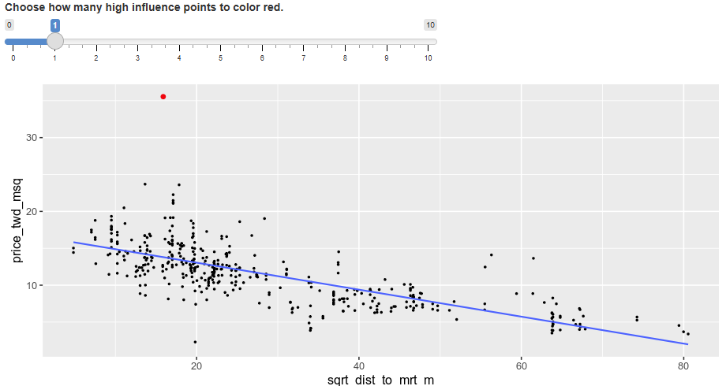

# Understanding Leverage in Linear Regression

## Introduction

Leverage is a crucial concept in regression diagnostics that measures how unusual or extreme the explanatory variables are for each observation. Understanding leverage helps identify potentially influential points in your regression analysis.


## The Question: Taiwan Real Estate Leverage

In the interactive plot showing leverage points for the Taiwan real estate model (house price vs. square root of distance to MRT station), we need to identify which observations have the highest leverage and why.

## The Correct Answer

**"Observations with a large distance to the nearest MRT station have the highest leverage, because most of the observations have a short distance, so long distances are more extreme."**

## Understanding Leverage

### What is Leverage?

**Leverage measures how extreme or unusual the explanatory variables are** for each observation. It quantifies how far each point's x-value is from the center of the x-values distribution.

### Key Characteristics of Leverage

- **X-variable focused**: Depends only on explanatory variables, not response variables
- **Distance from center**: High leverage occurs when x-values are far from the mean of all x-values
- **Extremeness measure**: Identifies observations in unusual regions of the explanatory variable space
- **Influence potential**: High leverage points have greater potential to influence the regression line

### Mathematical Intuition

For simple linear regression, leverage is higher for observations where:

- x-values are far from x̄ (mean of x-values)
- The distance |x - x̄| is large
- Points occupy unusual positions in the explanatory variable distribution

## Why This Answer is Correct

### Distribution Pattern

In the Taiwan real estate dataset:

- **Most observations cluster** at short distances to MRT stations (left side of plot)
- **Few observations exist** at long distances to MRT stations (right side of plot)
- **Long distances are statistically extreme** relative to the overall distribution

### Leverage Logic

- **Leverage identifies extremeness** in explanatory variable values
- **Rare, extreme x-values** have high leverage
- **Common, central x-values** have low leverage
- Distance to MRT follows this pattern: short distances are common, long distances are rare and extreme

## Why the Other Options Are Wrong

### ❌ Option 1: "Furthest from the regression trend line"

**This describes residuals, not leverage.**

- **Residuals** measure vertical distance from the regression line (prediction errors)
- **Leverage** measures horizontal extremeness in x-values
- Being far from the trend line indicates poor fit, not high leverage

### ❌ Option 2: "Leverage is proportional to the explanatory variable"

**This is mathematically incorrect.**

- Leverage depends on distance from the **center** of x-distribution, not absolute x-values
- A point with x = 100 could have lower leverage than x = 50 if most data clusters around x = 90
- It's about **relative extremeness**, not absolute magnitude

### ❌ Option 4: "High price observations have highest leverage"

**Price is the response variable, not explanatory variable.**

- **Leverage only depends on explanatory variables** (x-variables)
- **Price is the response variable** (y-variable) being predicted
- High y-values don't create leverage; they might create large residuals

## Visual Understanding

### In the Plot

- **Left side (short distances)**: Dense cluster of points = low leverage
- **Right side (long distances)**: Sparse, isolated points = high leverage
- **Red highlighted points**: Extreme distance values with highest leverage
- **Blue regression line**: Can be heavily influenced by high-leverage points

### Leverage Distribution

```
Low Leverage    |    High Leverage
(Common x)      |    (Extreme x)
     |          |          |
   ●●●●●        |         ●
   ●●●●●        |        ●
   ●●●●●        |       ●
     |          |          |
Short Distance  |    Long Distance
```

## Practical Implications

### Why Leverage Matters

**Influential Observations:**

- High leverage points can dramatically affect regression coefficients
- Moving a high-leverage point changes the regression line significantly
- Low leverage points have minimal impact on the overall fit

**Model Diagnostics:**

- Identify potentially problematic observations
- Assess model stability and robustness
- Guide decisions about data cleaning or model adjustments

**Statistical Inference:**

- High leverage affects standard errors and confidence intervals
- Can indicate extrapolation beyond typical data ranges
- Important for understanding prediction reliability

### Leverage vs. Other Diagnostics

| Measure                    | What it Identifies         | Focus                                 |
| -------------------------- | -------------------------- | ------------------------------------- |
| **Leverage**               | Extreme x-values           | Explanatory variable extremeness      |
| **Residuals**              | Prediction errors          | Model fit quality                     |
| **Cook's Distance**        | Overall influence          | Combined leverage and residual impact |
| **Standardized Residuals** | Relative prediction errors | Scaled model fit                      |

## Key Takeaways

### Remember These Points

1. **Leverage = Extremeness in explanatory variables**
2. **High leverage ≠ Bad fit** (that's residuals)
3. **Y-values don't determine leverage** (only x-values matter)
4. **Rare x-values = High leverage** (relative to distribution)
5. **Leverage indicates influence potential** (not actual influence)

### Diagnostic Workflow

1. **Identify high leverage points** using diagnostic plots
2. **Examine their explanatory variable values** (are they extreme?)
3. **Assess their impact** on model coefficients
4. **Consider data collection** (are extreme values valid?)
5. **Evaluate model robustness** with and without high leverage points

Understanding leverage helps you build more robust regression models by identifying observations that have the potential to disproportionately influence your results due to their unusual explanatory variable values.

# Understanding Influence and Cook's Distance in Linear Regression

## Introduction

Influence measures how much a regression model would change if each observation was removed from the analysis. It's a crucial diagnostic tool for identifying observations that have disproportionate impact on the regression results.


## The Question: Taiwan Real Estate Influence

In the interactive plot showing influential points for the Taiwan real estate model (house price vs. square root of distance to MRT station), we need to identify which observations have the highest influence and understand why.

## The Correct Answer

**"Observations far away from the trend line have high influence, because they have large residuals and are far away from other observations."**

## Understanding Influence

### What is Influence?

**Influence measures how much the regression model would change** if a particular observation was excluded from the analysis. It quantifies the impact of individual data points on:

- Regression coefficients (slope and intercept)
- Fitted values and predictions
- Overall model fit statistics

### Cook's Distance: The Standard Influence Measure

Cook's distance combines two key factors:

- **Residual size**: How far the point is from the regression line
- **Leverage**: How extreme the point's x-values are

**Formula intuition**: Cook's Distance ∝ (Residual Size) × (Leverage)

### Key Characteristics of Influence

- **Model change quantification**: Measures actual impact on regression results
- **Combines multiple factors**: Not just residuals or leverage alone
- **Practical importance**: Identifies points that matter most for model stability
- **Diagnostic tool**: Helps assess model robustness

## Why This Answer is Correct

### The Winning Combination

High influence occurs when observations have **both**:

1. **Large residuals** (far from trend line)
2. **High leverage** (far from other observations in x-space)

### Anatomy of the Correct Answer

**"Far away from the trend line"** = Large residuals

- These points don't fit the model well
- Removing them would change the regression line significantly
- They represent prediction errors that pull the line toward them

**"Far away from other observations"** = High leverage

- These points occupy unusual positions in the explanatory variable space
- They have greater potential to influence the regression line
- Their extreme x-values give them more "weight" in determining the slope

### Why Both Factors Matter

- **Large residual alone**: Point doesn't fit well, but if it has low leverage, removing it won't change the line much
- **High leverage alone**: Point has potential influence, but if it fits the line well (small residual), removing it won't change much
- **Both together**: Point doesn't fit well AND has high leverage = maximum influence

## Why the Other Options Are Wrong

### ❌ Option 2: "High prices have high influence, because influence is proportional to the response variable"

**Influence doesn't depend directly on y-values.**

- **Cook's distance formula** doesn't include raw y-values
- **High y-values** might create large residuals, but only if they don't fit the line
- **Response variable magnitude** alone doesn't determine influence
- A high-priced house that fits the trend line perfectly would have low influence

### ❌ Option 3: "Far from trend line have high influence, because the slope is negative"

**Slope direction is irrelevant to influence calculation.**

- **Cook's distance** doesn't depend on whether slope is positive or negative
- **Influence magnitude** is the same regardless of slope direction
- **Residual size matters**, not the sign of the slope
- This confuses correlation direction with influence magnitude

### ❌ Option 4: "Far from trend line have high influence, because that increases leverage"

**Distance from trend line doesn't increase leverage.**

- **Leverage depends only on x-values** (explanatory variables)
- **Distance from trend line** measures residuals (y-direction)
- **Leverage is about x-extremeness**, not y-extremeness
- This confuses residuals with leverage

## Visual Understanding

### In the Plot

Looking at the Taiwan real estate plot:

- **Red highlighted point**: High influence observation
- **Location**: Far from trend line (large residual) AND at extreme x-value (high leverage)
- **Impact**: Removing this point would noticeably change the regression line
- **Combination effect**: Both residual and leverage contribute to high influence

### Influence Patterns

```
                High Influence Zone
                     |
    High    |    ●   |   ●     | Large residuals +
 Residuals  |  Far from line   | High leverage
            |        |         |
    --------+--------+---------+--------
            |        |         |
    Low     |    ●   |   ●●●●● | Small residuals
 Residuals  |  On/near line    | (various leverage)
            |        |         |
         Low Leverage | High Leverage
```

## Practical Implications

### Why Influence Matters

**Model Stability:**

- High influence points can dramatically alter regression results
- Model conclusions might change based on a few observations
- Important for assessing result reliability

**Outlier Detection:**

- Identifies observations that don't follow the general pattern
- Helps distinguish between unusual but valid data vs. errors
- Guides data cleaning and validation decisions

**Prediction Reliability:**

- High influence points affect predictions for new observations
- Model performance might be misleading if driven by few points
- Important for understanding generalizability

### Cook's Distance Interpretation Guidelines

| Cook's Distance | Interpretation          | Action               |
| --------------- | ----------------------- | -------------------- |
| **< 0.5**       | Low influence           | Generally acceptable |
| **0.5 - 1.0**   | Moderate influence      | Investigate further  |
| **> 1.0**       | High influence          | Examine carefully    |
| **> 4/n**       | Rule of thumb threshold | Consider for removal |

_where n = sample size_

## Diagnostic Workflow

### Identifying Influential Points

1. **Calculate Cook's distance** for all observations
2. **Create influence plots** to visualize high-influence points
3. **Examine characteristics** of influential observations
4. **Check data validity** (measurement errors, data entry mistakes?)
5. **Assess substantive importance** (are these points meaningful?)

### Handling Influential Points

**Investigation Steps:**

- **Verify data accuracy**: Check for measurement or recording errors
- **Assess representativeness**: Do these points represent valid cases?
- **Consider context**: Are extreme values expected in this domain?
- **Examine model specification**: Should the model account for these patterns?

**Potential Actions:**

- **Correct errors** if data mistakes are found
- **Keep valid outliers** but report their influence
- **Use robust regression** methods less sensitive to outliers
- **Transform variables** to reduce influence of extreme values
- **Collect more data** in extreme regions to balance influence

## Key Takeaways

### Remember These Points

1. **Influence = Residual × Leverage** (Cook's distance combines both)
2. **High influence needs both factors** (large residual AND high leverage)
3. **Distance from trend line ≠ High leverage** (different concepts)
4. **Y-values alone don't determine influence** (need x-extremeness too)
5. **Influential points deserve investigation**, not automatic removal

### Diagnostic Integration

- **Use influence with other diagnostics** (residuals, leverage, Q-Q plots)
- **Consider multiple perspectives** on the same observations
- **Make informed decisions** about data treatment
- **Document analysis choices** for transparency and reproducibility

Understanding influence helps you build more robust and reliable regression models by identifying observations that have the potential to dramatically affect your results and conclusions.
# Extracting Leverage and Influence from Regression Models

## Introduction

After visually exploring leverage and influence in diagnostic plots, it's important to extract the actual numerical values. This allows for systematic analysis, identification of specific observations, and quantitative decision-making about influential points.

## The Task

Extract leverage and influence statistics from the Taiwan real estate model (`mdl_price_vs_dist`) that predicts house prices based on distance to MRT stations.

## Solution

```python
# Create summary_info
summary_info = mdl_price_vs_dist.get_influence().summary_frame()
```

## Understanding the Code

### Method Breakdown

**`mdl_price_vs_dist.get_influence()`**
- Calculates comprehensive influence diagnostics for the fitted model
- Returns an influence object containing various diagnostic measures
- Provides access to leverage, Cook's distance, and other influence statistics

**`.summary_frame()`**
- Converts the influence diagnostics into a pandas DataFrame
- Makes the results easy to view, filter, and analyze
- Includes multiple diagnostic columns for each observation

## What's in summary_info

### Key Columns in the Results

The `summary_info` DataFrame typically contains:

| Column | Description | Interpretation |
|--------|-------------|----------------|
| **`hat_diag`** | Leverage values | Diagonal elements of hat matrix; measures x-extremeness |
| **`cooks_d`** | Cook's distance | Overall influence measure combining residuals and leverage |
| **`standard_resid`** | Standardized residuals | Residuals divided by their standard error |
| **`student_resid`** | Studentized residuals | More sophisticated standardized residuals |
| **`dffits`** | DFFITS | Influence on fitted values |
| **`dfbetas`** | DFBETAS | Influence on individual regression coefficients |

### Most Important Measures

**Leverage (`hat_diag`):**
- Values typically range from 0 to 1
- Higher values indicate more extreme explanatory variable values
- Rule of thumb: Values > 2p/n or 3p/n may be concerning (p = parameters, n = sample size)

**Cook's Distance (`cooks_d`):**
- Measures overall influence of each observation
- Values > 0.5 suggest moderate influence
- Values > 1.0 suggest high influence
- Rule of thumb: Values > 4/n warrant investigation

## Practical Usage Examples

### Basic Exploration

```python
# Create summary_info
summary_info = mdl_price_vs_dist.get_influence().summary_frame()

# View first few rows
print(summary_info.head())

# Check data types and columns
print(summary_info.info())

# Basic statistics
print(summary_info.describe())
```

### Identifying High Leverage Points

```python
# Calculate leverage threshold (common rule: 2p/n)
n_obs = len(taiwan_real_estate)
n_params = len(mdl_price_vs_dist.params)  # includes intercept
leverage_threshold = 2 * n_params / n_obs

# Find high leverage observations
high_leverage = summary_info[summary_info['hat_diag'] > leverage_threshold]
print(f"High leverage points (>{leverage_threshold:.3f}):")
print(high_leverage[['hat_diag']].sort_values('hat_diag', ascending=False))
```

### Identifying Influential Points

```python
# Find high influence observations using Cook's distance
high_influence = summary_info[summary_info['cooks_d'] > 0.5]
print("High influence points (Cook's distance > 0.5):")
print(high_influence[['cooks_d', 'hat_diag', 'standard_resid']].sort_values('cooks_d', ascending=False))

# Alternative threshold: 4/n rule
influence_threshold = 4 / len(taiwan_real_estate)
high_influence_alt = summary_info[summary_info['cooks_d'] > influence_threshold]
print(f"\nHigh influence points (Cook's distance > {influence_threshold:.3f}):")
print(high_influence_alt[['cooks_d']].sort_values('cooks_d', ascending=False))
```

### Combining with Original Data

```python
# Add influence statistics to original dataset
taiwan_with_diagnostics = taiwan_real_estate.copy()
taiwan_with_diagnostics['leverage'] = summary_info['hat_diag']
taiwan_with_diagnostics['cooks_distance'] = summary_info['cooks_d']
taiwan_with_diagnostics['std_residual'] = summary_info['standard_resid']

# Find the most influential observations
most_influential = taiwan_with_diagnostics.nlargest(5, 'cooks_distance')
print("Top 5 most influential observations:")
print(most_influential[['price_twd_msq', 'sqrt_dist_to_mrt_m', 'leverage', 'cooks_distance']])
```

## Diagnostic Workflow

### Step-by-Step Analysis

```python
# 1. Extract influence diagnostics
summary_info = mdl_price_vs_dist.get_influence().summary_frame()

# 2. Set thresholds
n = len(taiwan_real_estate)
p = len(mdl_price_vs_dist.params)
leverage_threshold = 2 * p / n
influence_threshold = 4 / n

# 3. Identify problematic points
high_leverage_idx = summary_info['hat_diag'] > leverage_threshold
high_influence_idx = summary_info['cooks_d'] > influence_threshold
high_residual_idx = abs(summary_info['standard_resid']) > 2

# 4. Create diagnostic summary
diagnostic_summary = pd.DataFrame({
    'observation': range(len(summary_info)),
    'high_leverage': high_leverage_idx,
    'high_influence': high_influence_idx,
    'high_residual': high_residual_idx,
    'any_concern': high_leverage_idx | high_influence_idx | high_residual_idx
})

# 5. Report findings
print(f"Observations with concerns: {diagnostic_summary['any_concern'].sum()}")
print(f"High leverage: {high_leverage_idx.sum()}")
print(f"High influence: {high_influence_idx.sum()}")
print(f"High residuals: {high_residual_idx.sum()}")
```

## Interpretation Guidelines

### When to Investigate Further

**High Leverage Points:**
- Check if x-values are realistic and correctly recorded
- Consider if extreme values represent valid cases
- Assess whether model should account for these ranges

**High Influence Points:**
- Examine both x and y values for accuracy
- Consider substantive importance of these observations
- Evaluate model stability with and without these points

**High Residual Points:**
- Check for data entry errors
- Consider model specification issues
- Assess whether outliers represent different populations

### Decision Framework

```python
def assess_observation(leverage, cooks_d, std_resid, leverage_thresh, influence_thresh):
    """Assess individual observation characteristics"""
    issues = []
    
    if leverage > leverage_thresh:
        issues.append("High leverage")
    if cooks_d > influence_thresh:
        issues.append("High influence")
    if abs(std_resid) > 2:
        issues.append("Large residual")
    
    if len(issues) == 0:
        return "No concerns"
    elif len(issues) == 1:
        return f"Moderate concern: {issues[0]}"
    else:
        return f"High concern: {', '.join(issues)}"

# Apply assessment
taiwan_with_diagnostics['assessment'] = [
    assess_observation(lev, cook, resid, leverage_threshold, influence_threshold)
    for lev, cook, resid in zip(
        summary_info['hat_diag'], 
        summary_info['cooks_d'], 
        summary_info['standard_resid']
    )
]

print(taiwan_with_diagnostics['assessment'].value_counts())
```

## Key Takeaways

### Essential Points
1. **`get_influence().summary_frame()`** extracts comprehensive diagnostic statistics
2. **Combine numerical thresholds** with visual diagnostics for complete analysis
3. **Investigate systematically** rather than automatically removing points
4. **Document decisions** about how to handle influential observations
5. **Consider practical significance** alongside statistical thresholds

### Next Steps After Extraction
- **Validate suspect observations** through data checking
- **Assess model robustness** by fitting with/without influential points
- **Consider alternative models** if many observations are problematic
- **Report diagnostic findings** transparently in analysis documentation

This systematic approach to extracting and analyzing influence diagnostics ensures thorough and defensible regression analysis.