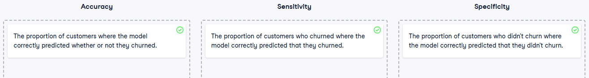

# Four Ways to Express Logistic Regression Predictions

## Introduction

Logistic regression predictions can be expressed in four different ways, each with its own advantages and use cases. Understanding these different representations helps you choose the most appropriate format for your audience and analytical needs.

## Part 1: Probabilities

### Concept

The most straightforward interpretation of logistic regression output is as probabilities - the chance that the event of interest (e.g., customer churn) will occur.

### Advantages

- **Intuitive interpretation**: Easy for most people to understand
- **Direct business meaning**: "There's a 60% chance this customer will churn"
- **Range bounded**: Always between 0 and 1
- **Statistical foundation**: Directly relates to the underlying statistical model

### Task

Calculate churn probabilities for different relationship lengths.

### Solution

```python
# Create prediction_data
prediction_data = explanatory_data.assign(
    has_churned=mdl_churn_vs_relationship.predict(explanatory_data)
)

# Print the head
print(prediction_data.head())
```

**Code Explanation:**

- `explanatory_data.assign()` - adds new column to DataFrame
- `mdl_churn_vs_relationship.predict()` - generates probability predictions
- `has_churned` - new column containing churn probabilities (0 to 1)
- Results show probability of churn for each relationship length

### Interpretation Example

If `has_churned = 0.65`, this means:

- 65% probability the customer will churn
- 35% probability the customer will be retained

## Part 2: Most Likely Outcome

### Concept

Converting probabilities to binary predictions by applying a decision threshold (typically 0.5). This simplifies communication by stating the most likely outcome rather than discussing probabilities.

### Advantages

- **Simple communication**: "This customer will likely churn" vs. "60% churn probability"
- **Clear actionability**: Direct yes/no decisions
- **Removes probability complexity**: Easier for non-technical audiences
- **Binary classification**: Matches many business decision frameworks

### Trade-offs

- **Loss of nuance**: 51% and 99% probabilities both become "will churn"
- **Threshold dependency**: Results change based on cutoff choice
- **Information loss**: Discards valuable uncertainty information

### Task

Convert probabilities to most likely outcomes using 0.5 threshold.

### Solution

```python
# Update prediction data by adding most_likely_outcome
prediction_data["most_likely_outcome"] = np.round(mdl_churn_vs_relationship.predict(explanatory_data))

# Print the head
print(prediction_data.head())
```

**Code Explanation:**

- `np.round()` - rounds probabilities to nearest integer (0 or 1)
- Values ≥ 0.5 become 1 (will churn)
- Values < 0.5 become 0 (will not churn)
- Creates binary classification from probability predictions

### Business Application

```python
# Custom threshold example
threshold = 0.3  # Lower threshold for conservative churn prevention
prediction_data["high_risk"] = (prediction_data["has_churned"] >= threshold).astype(int)
```

## Part 3: Odds Ratio

### Concept

Odds ratios compare the probability of an event happening versus not happening. They express the relative likelihood in a ratio format.

### Mathematical Relationship

**Odds = Probability / (1 - Probability)**

For example:

- 20% churn probability → Odds = 0.20 / 0.80 = 0.25
- Interpretation: "For every 1 customer who churns, 4 customers don't churn"

### Advantages

- **Intuitive comparisons**: "4 times more likely to stay than leave"
- **Relative interpretation**: Focuses on comparative likelihood
- **Useful for decision-making**: Helps weigh options
- **Common in gambling/betting**: Familiar concept to many

### Task

Calculate odds ratios from churn probabilities.

### Solution

```python
# Update prediction data with odds_ratio
prediction_data["odds_ratio"] = prediction_data["has_churned"] / (1 - prediction_data["has_churned"])

# Print the head
print(prediction_data.head())
```

**Code Explanation:**

- `has_churned / (1 - has_churned)` - converts probability to odds
- Numerator: probability of churning
- Denominator: probability of not churning
- Result: ratio expressing relative likelihood

### Interpretation Guide

| Odds Ratio | Meaning                                               |
| ---------- | ----------------------------------------------------- |
| **< 1**    | Event less likely than not (e.g., 0.25 = 1:4 against) |
| **= 1**    | Event equally likely as not (50% probability)         |
| **> 1**    | Event more likely than not (e.g., 3 = 3:1 in favor)   |

### Business Examples

```python
# Interpretation helper function
def interpret_odds(odds_ratio):
    if odds_ratio < 1:
        return f"Customer is {1/odds_ratio:.1f} times more likely to stay than churn"
    elif odds_ratio > 1:
        return f"Customer is {odds_ratio:.1f} times more likely to churn than stay"
    else:
        return "Customer is equally likely to churn or stay"

# Apply to predictions
prediction_data["interpretation"] = prediction_data["odds_ratio"].apply(interpret_odds)
```

## Part 4: Log Odds Ratio (Logit)

### Concept

The natural logarithm of the odds ratio, also called the logit. This is the scale on which logistic regression actually operates internally.

### Mathematical Relationship

**Log Odds = ln(Odds) = ln(Probability / (1 - Probability))**

### Advantages

- **Linear relationship**: Changes linearly with explanatory variables
- **Symmetric range**: -∞ to +∞ (unlike bounded probabilities)
- **Statistical properties**: Basis of logistic regression mathematics
- **Coefficient interpretation**: Direct relationship to model parameters

### Why This Matters

- **Model coefficients** represent changes in log odds
- **Linear changes** in explanatory variables produce linear changes in log odds
- **No dramatic curves** like with probabilities or odds ratios

### Task

Calculate log odds ratios from odds ratios.

### Solution

```python
# Update prediction data with log_odds_ratio
prediction_data["log_odds_ratio"] = np.log(prediction_data["odds_ratio"])

# Print the head
print(prediction_data.head())
```

**Code Explanation:**

- `np.log()` - natural logarithm of odds ratio
- Converts curved odds relationship to linear log odds
- Values range from -∞ (probability near 0) to +∞ (probability near 1)
- Zero represents 50% probability (equal odds)

### Interpretation Guide

| Log Odds | Odds Ratio | Probability | Meaning       |
| -------- | ---------- | ----------- | ------------- |
| **-∞**   | 0          | 0%          | Impossible    |
| **-2**   | 0.14       | 12%         | Very unlikely |
| **-1**   | 0.37       | 27%         | Unlikely      |
| **0**    | 1.00       | 50%         | Equal chance  |
| **1**    | 2.72       | 73%         | Likely        |
| **2**    | 7.39       | 88%         | Very likely   |
| **+∞**   | ∞          | 100%        | Certain       |

## Comprehensive Prediction Workflow

### Complete Analysis Example

```python
import numpy as np
import pandas as pd

# Generate comprehensive predictions
def create_full_predictions(model, explanatory_data):
    # 1. Probabilities
    probabilities = model.predict(explanatory_data)

    # 2. Most likely outcomes
    most_likely = np.round(probabilities)

    # 3. Odds ratios
    odds_ratios = probabilities / (1 - probabilities)

    # 4. Log odds ratios
    log_odds_ratios = np.log(odds_ratios)

    # Combine all representations
    full_predictions = explanatory_data.assign(
        probability=probabilities,
        most_likely_outcome=most_likely,
        odds_ratio=odds_ratios,
        log_odds_ratio=log_odds_ratios
    )

    return full_predictions

# Apply to churn model
comprehensive_predictions = create_full_predictions(
    mdl_churn_vs_relationship,
    explanatory_data
)

print(comprehensive_predictions.head())
```

## Choosing the Right Representation

### Decision Framework

| Audience             | Best Representation          | Reason                                |
| -------------------- | ---------------------------- | ------------------------------------- |
| **General Business** | Probabilities or Most Likely | Intuitive, actionable                 |
| **Risk Managers**    | Probabilities                | Quantifies uncertainty                |
| **Decision Makers**  | Most Likely Outcome          | Clear yes/no guidance                 |
| **Analysts**         | Odds Ratios                  | Comparative insights                  |
| **Data Scientists**  | Log Odds                     | Linear relationships, model internals |

### Visualization Considerations

```python
# Different scales for different purposes
import matplotlib.pyplot as plt

fig, axes = plt.subplots(2, 2, figsize=(12, 10))

# 1. Probability scale (curved)
axes[0,0].plot(prediction_data.iloc[:,0], prediction_data['probability'])
axes[0,0].set_title('Probability Scale')
axes[0,0].set_ylabel('Churn Probability')

# 2. Most likely outcome (binary)
axes[0,1].plot(prediction_data.iloc[:,0], prediction_data['most_likely_outcome'])
axes[0,1].set_title('Most Likely Outcome')
axes[0,1].set_ylabel('Will Churn (0/1)')

# 3. Odds ratio (curved, log scale better)
axes[1,0].plot(prediction_data.iloc[:,0], prediction_data['odds_ratio'])
axes[1,0].set_yscale('log')
axes[1,0].set_title('Odds Ratio (Log Scale)')
axes[1,0].set_ylabel('Odds Ratio')

# 4. Log odds ratio (linear)
axes[1,1].plot(prediction_data.iloc[:,0], prediction_data['log_odds_ratio'])
axes[1,1].set_title('Log Odds Ratio')
axes[1,1].set_ylabel('Log Odds')

plt.tight_layout()
plt.show()
```

## Key Takeaways

### Understanding the Four Representations

1. **Probabilities**: Most intuitive, bounded 0-1, curved relationship
2. **Most Likely Outcome**: Simplest communication, binary, loses nuance
3. **Odds Ratio**: Comparative interpretation, multiplicative, curved relationship
4. **Log Odds Ratio**: Linear relationship, statistical foundation, less intuitive

### Practical Applications

- **Use probabilities** for risk assessment and general communication
- **Use most likely outcomes** for clear binary decisions
- **Use odds ratios** for comparative analysis and betting-like decisions
- **Use log odds** for statistical analysis and understanding model behavior

### Model Interpretation

Each representation provides different insights into the same underlying model, allowing you to tailor your communication and analysis to your specific needs and audience.

