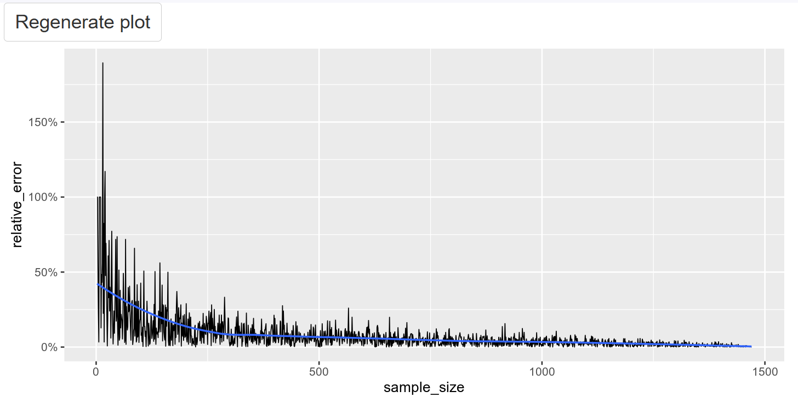

# Revision Notes: Relative Error and Sample Size

## Learning Objectives

1. Understand relative error as a metric for assessing sampling accuracy
2. Learn the relationship between sample size and estimation accuracy
3. Interpret how relative error behaves across different sample sizes

## Key Concepts



### **What is Relative Error?**

Relative error measures how far a sample estimate is from the true population parameter, expressed as a percentage of the population parameter.

**Formula:**

```
Relative Error = |Population Parameter - Sample Estimate| / Population Parameter
```

**As Percentage:**

```
Relative Error % = (|Population Parameter - Sample Estimate| / Population Parameter) × 100
```

### **Implementation**

```python
# Step 1: Generate sample
attrition_srs50 = attrition_pop.sample(n=50, random_state=2022)

# Step 2: Calculate sample estimate
mean_attrition_srs50 = attrition_srs50["Attrition"].mean()

# Step 3: Calculate relative error percentage
rel_error_pct50 = (abs(mean_attrition_pop - mean_attrition_srs50) / mean_attrition_pop) * 100

print(rel_error_pct50)
```

## Understanding the Plot

### **What the Plot Shows**

The plot displays relative error (y-axis) versus sample size (x-axis) for sample sizes from 2 to 1,470 (full population).

**Key Observations:**

- **Small samples (left side)**: High, variable relative errors
- **Large samples (right side)**: Low, stable relative errors
- **Blue trend line**: Shows average relationship between sample size and error
- **Black vertical lines**: Individual sample results showing variability

### **Pattern Analysis**

1. **Decreasing trend**: Relative error generally decreases as sample size increases
2. **High variability with small samples**: Individual results vary widely
3. **Convergence**: Error approaches zero as sample size approaches population size
4. **Diminishing returns**: Improvement rate slows with larger samples

## Answer to the Question

**Correct Answer: "For small sample sizes, each additional entry in a sample can result in substantial decreases to the relative error."**

### **Why This is Correct**

Looking at the plot's left side (small sample sizes):

- Moving from n=2 to n=10 can dramatically reduce relative error
- Each additional observation has high impact when starting from very small samples
- The slope is steepest for small sample sizes

### **Why Other Options Are Wrong**

**"For any given sample size, the relative error is fixed"**

- ❌ False: The plot shows variability (vertical lines) at each sample size
- Different random samples of the same size produce different errors

**"When sample equals population, error is small but never zero"**

- ❌ False: When sample = population, the sample mean = population mean exactly
- Relative error = |pop_mean - pop_mean| / pop_mean = 0

**"If sample mean > population mean, relative error can be negative"**

- ❌ False: Relative error uses absolute value |pop - sample|
- Result is always non-negative

**"Relative error can never be greater than 100%"**

- ❌ False: If sample mean = 0 and population mean > 0, error = 100%
- If sample mean and population mean have opposite signs, error can exceed 100%

## Key Insights from the Relationship

### **Sample Size Effects**

1. **Very small samples (n < 20)**: Highly unreliable, errors can be extreme
2. **Small samples (n = 20-100)**: Still substantial improvement with each addition
3. **Medium samples (n = 100-500)**: Moderate improvements, more predictable
4. **Large samples (n > 500)**: Diminishing returns, expensive for small gains

### **Practical Implications**

- **Don't use tiny samples**: n < 10 is generally unreliable for estimation
- **Consider cost-benefit**: Moving from n=50 to n=100 may be worthwhile
- **Law of diminishing returns**: n=1000 to n=1200 may not justify extra cost
- **Context matters**: Required accuracy depends on decision importance

## Technical Details

### **Why Relative Error Matters**

```python
# Absolute error can be misleading
abs_error = abs(pop_mean - sample_mean)  # Same absolute difference

# But relative impact depends on scale
rel_error = abs_error / pop_mean  # Scales by parameter size
```

**Example:**

- Population mean = 0.16 (16% attrition rate)
- Sample mean = 0.20 (20% attrition rate)
- Absolute error = 0.04
- Relative error = 0.04/0.16 = 25% (substantial!)

### **Formula Components**

- **Numerator**: `|Population Parameter - Sample Estimate|`
  - Absolute value ensures non-negative result
  - Measures distance between true and estimated values
- **Denominator**: `Population Parameter`
  - Scales the error by parameter magnitude
  - Makes errors comparable across different scales

## Best Practices

### **Sample Size Planning**

1. **Consider acceptable error level**: What % error can you tolerate?
2. **Plot error vs. sample size**: Find the "knee" of diminishing returns
3. **Balance cost and precision**: More samples cost more but reduce error
4. **Use pilot studies**: Small samples to estimate required full sample size

### **Error Interpretation**

- **< 5% relative error**: Generally considered very good
- **5-10% relative error**: Acceptable for many applications
- **10-25% relative error**: May be acceptable for exploratory analysis
- **> 25% relative error**: Generally indicates insufficient sample size

### **Common Applications**

- **Market research**: Estimating customer satisfaction scores
- **Quality control**: Monitoring defect rates
- **Medical research**: Estimating treatment effect sizes
- **Survey research**: Measuring population attitudes or behaviors

## Key Takeaways

1. **Relative error decreases as sample size increases** (general trend)
2. **Small samples show high variability** in their error rates
3. **Each additional observation matters most** when starting from very small samples
4. **Perfect accuracy only occurs** when sample = entire population
5. **Cost-benefit analysis** should guide sample size decisions
6. **Context determines** what level of relative error is acceptable
