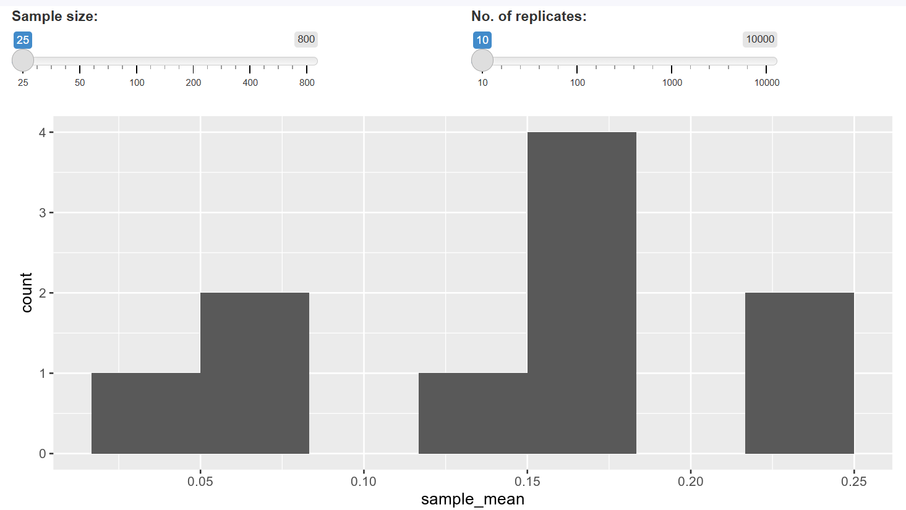

# Revision Notes: Sample Replication and Distribution of Sample Means

## Learning Objectives

1. Understand the concept of sampling variability and why replication is necessary
2. Learn how to generate multiple samples to study the distribution of sample means
3. Analyze how sample size and number of replicates affect the sampling distribution

## Key Concepts

### **What is Sample Replication?**

Sample replication involves:

- Taking **multiple samples** from the same population
- Calculating the **same statistic** (e.g., mean) for each sample
- Studying the **distribution** of these statistics
- Understanding the **variability** inherent in sampling

### **Why Replication Matters**

Each sample gives a slightly different result due to:

- **Random selection**: Different observations included each time
- **Sampling variability**: Natural variation in sample composition
- **Uncertainty quantification**: Need to understand how much estimates vary

## Implementation

### **Creating Multiple Sample Means**

```python
# Create an empty list to store results
mean_attritions = []

# Loop 500 times to create 500 sample means
for i in range(500):
    sample_mean = attrition_pop.sample(n=60)['Attrition'].mean()
    mean_attritions.append(sample_mean)

# Check the first few results
print(mean_attritions[0:5])
```

### **Visualizing the Distribution**

```python
# Create histogram of the 500 sample means
plt.hist(mean_attritions, bins=16)
plt.show()
```

**What This Shows:**

- **Distribution shape**: How sample means are distributed around the true population mean
- **Spread**: Range of possible sample mean values
- **Central tendency**: Where most sample means cluster
- **Variability**: How much sample means differ from each other

## Understanding the Interactive Dashboard

### **Two Key Parameters**

#### **1. Sample Size (n)**

Controls how many observations are in each individual sample

- **Small sample size**: Each sample has fewer observations
- **Large sample size**: Each sample has more observations

#### **2. Number of Replicates**

Controls how many different samples are taken

- **Few replicates**: Fewer data points in the histogram
- **Many replicates**: More data points, smoother histogram shape
  

## Effect of Parameters on Sample Mean Distribution

### **Sample Size Effects**

#### **Small Sample Size (e.g., n=25)**

- **Wide spread**: Sample means vary significantly
- **High variability**: Individual samples can be quite different
- **Less precision**: Each estimate is less reliable
- **Wider histogram**: Distribution spans broader range

#### **Large Sample Size (e.g., n=800)**

- **Narrow spread**: Sample means cluster tightly around population mean
- **Low variability**: Individual samples are more similar
- **High precision**: Each estimate is more reliable
- **Narrower histogram**: Distribution is more concentrated

### **Number of Replicates Effects**

#### **Few Replicates (e.g., 10)**

- **Choppy histogram**: Irregular, sparse appearance
- **Same underlying spread**: Range doesn't change
- **Less clear pattern**: Hard to see true distribution shape
- **More uncertainty**: Less confident about distribution properties

#### **Many Replicates (e.g., 10,000)**

- **Smooth histogram**: Clear, well-defined shape
- **Same underlying spread**: Range remains the same
- **Clear pattern**: Distribution shape is evident
- **More certainty**: Confident about distribution properties

## Answer to the Question

**Correct Answer: "As the sample size increases, the range of calculated sample means tends to decrease."**

### **Why This is Correct**

- **Larger samples** are more representative of the population
- **More observations** reduce the impact of individual extreme values
- **Central Limit Theorem**: Larger samples produce means closer to population mean
- **Standard error decreases**: Spread of sample means gets smaller

### **Why Other Options Are Wrong**

**"As sample size increases, range tends to increase"**

- ❌ Opposite of the truth
- Larger samples are more stable, not more variable

**"As number of replicates increases, range tends to increase"**

- ❌ Number of replicates doesn't change the spread
- More replicates just give a clearer picture of the same distribution

**"As number of replicates increases, range tends to decrease"**

- ❌ Number of replicates doesn't affect the underlying variability
- More replicates show the same spread more clearly

## The Central Limit Theorem Connection

### **Key Principle**

As sample size increases:

1. **Sample means approach normal distribution** (regardless of population shape)
2. **Mean of sample means equals population mean** (unbiased)
3. **Standard deviation of sample means decreases** (less variability)

### **Mathematical Relationship**

```
Standard Error = Population Standard Deviation / √(Sample Size)
```

**Implications:**

- **Doubling sample size** reduces standard error by factor of √2 ≈ 1.41
- **Quadrupling sample size** reduces standard error by factor of 2
- **Diminishing returns**: Larger samples give smaller improvements

## Practical Applications

### **Quality Control**

```python
# Monitor production quality with repeated sampling
daily_samples = []
for day in range(30):
    daily_sample = production_data.sample(n=100)
    daily_samples.append(daily_sample['defect_rate'].mean())
```

### **Survey Research**

```python
# Understand variability in customer satisfaction
satisfaction_means = []
for survey in range(200):
    survey_sample = customers.sample(n=50)
    satisfaction_means.append(survey_sample['satisfaction'].mean())
```

### **Medical Research**

```python
# Study treatment effect consistency
treatment_effects = []
for trial in range(100):
    trial_sample = patients.sample(n=30)
    treatment_effects.append(trial_sample['improvement'].mean())
```

## Best Practices

### **Choosing Sample Size**

- **Consider required precision**: How accurate do estimates need to be?
- **Balance cost vs. accuracy**: Larger samples cost more but are more precise
- **Use power analysis**: Statistical methods to determine optimal sample size
- **Pilot studies**: Small studies to estimate variability for planning

### **Choosing Number of Replicates**

- **Simulation studies**: Use many replicates (1000+) to understand properties
- **Bootstrap methods**: Often use 1000-10000 replicates
- **Computational limits**: Balance accuracy with available computing time
- **Diminishing returns**: More replicates give clearer picture but same conclusions

### **Interpretation Guidelines**

- **Look at the shape**: Normal distribution indicates good sampling
- **Check the center**: Should be close to known population parameter
- **Assess the spread**: Indicates precision of individual estimates
- **Consider sample size**: Smaller spread with larger individual samples

## Key Takeaways

1. **Sample means vary randomly** due to different observations in each sample
2. **Larger individual samples** produce less variable sample means (narrower distribution)
3. **More replicates** give clearer picture of the distribution but don't change its spread
4. **Central Limit Theorem** explains why larger samples are more reliable
5. **Replication helps quantify uncertainty** inherent in sampling
6. **Both parameters matter** but affect different aspects of the analysis
